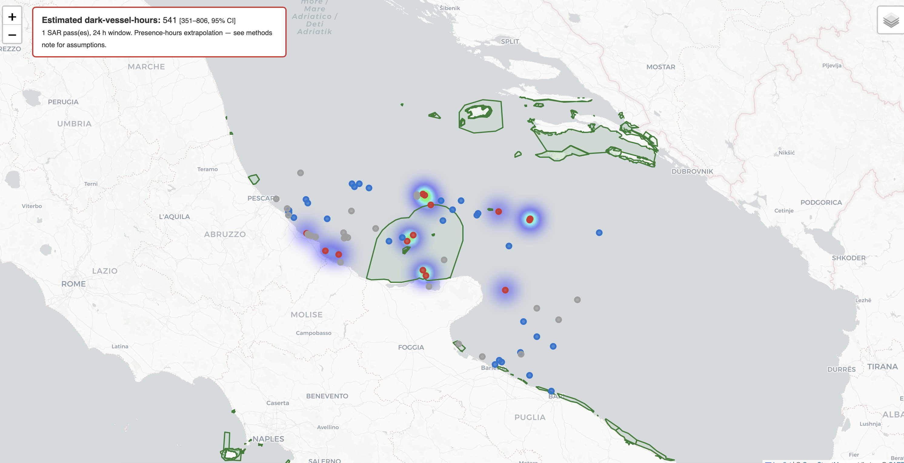
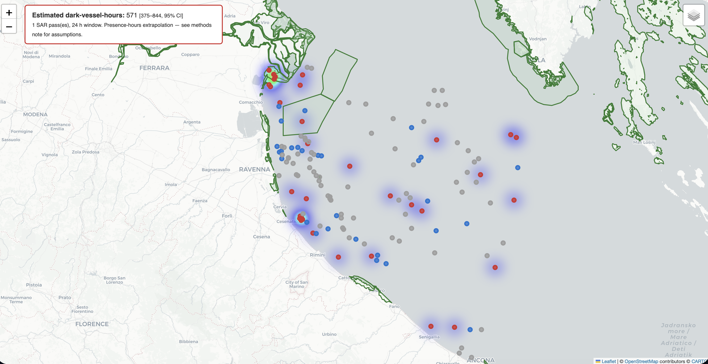

# Dark-Vessel Detection on SAR

Finding the fishing boats that switch off their transponders to hide.

About one in five large fishing vessels goes "dark" at times — it's physically
there on the water but broadcasting no AIS identity signal — and a lot of that
happens inside protected waters where fishing isn't allowed. Optical
satellites can't help much (clouds, night), and AIS by definition can't see a
boat that's stopped broadcasting. Radar can: Sentinel-1 images the sea day or
night, through cloud, whether or not a ship is cooperating.

This project trains a detector on the **xView3-SAR** dataset, then does
something the basic "detect ships, report a score" version doesn't: it figures
out which detected vessels were *not* broadcasting AIS, and maps where those
dark vessels show up inside marine protected areas in the Adriatic.

The one-line idea behind the whole thing: **the radar sees the boat, AIS
doesn't, and that mismatch is what we're actually after.**

One thing worth being clear about, because it's easy to overclaim: you can't
look at a radar image and tell whether a boat's transponder is on. A dark
trawler and a cooperative trawler look identical to radar. "Dark" isn't
something the neural network sees — it's what you get *after* you cross-check a
radar detection against the AIS record and find no match. So the machine
learning does the part that genuinely needs it (finding small, faint boats and
sorting vessels from fishing boats from fixed structures), and the dark label
comes from data fusion on top of that.

---

## What came out of it

I ran the trained model on a few Adriatic scenes and looked at where the dark
vessels landed:

| Area | What's there |
|---|---|
| **Isole Tremiti** (Italy) | 5 dark fishing vessels sitting inside the Tremiti marine reserve (out of 8 boats total in the reserve). Rough estimate: ~540 dark-vessel-hours over a 24-hour window, though the range is wide (350–810). |
| **Po delta** (Emilia-Romagna) | The busiest scene for dark activity — 34 dark vessels in total, 4 of them inside the Sacca di Goro / Po-delta reserves. ~290 dark-vessel-hours (160–490). |



*Red dots are dark vessels (no AIS match), blue are cooperative (AIS found),
green outlines are the protected-area boundaries. The glow is dark-vessel
density, and the box up top gives the dark-vessel-hours estimate with its
uncertainty range.*



The "hours" figures are extrapolations from single snapshots, not
measurements, and I've tried to be upfront about every assumption behind them
in [RESULTS.md](RESULTS.md).

---

## How well does it actually work?

These are measured on validation scenes the model never trained on:

| Metric | Baseline (5 training scenes) | Final (29 training scenes) |
|---|---|---|
| Detection F1 (within 200 m) | 0.50 – 0.68 | 0.57 – 0.69 |
| Dark recall | 0.16 – 0.33 | 0.22 – 0.34 |
| Detection precision | ~0.95 | 0.78 – 0.95 |
| Fishing-class F1 | — | 0.90 – 0.96 |

The honest headline isn't the detection F1, it's the dark recall. Overall the
model finds about half the vessels, but on the *dark* subset specifically it
only catches around a third — because dark vessels tend to be the small, faint
fishing boats that are hardest to see in radar. That gap is the number that
actually matters for the mission, and it's the one the standard xView3 score
doesn't report. Adding more training data helped most on the hardest scene
(dark recall there went up ~40%) and barely moved the scenes that were already
near their ceiling, which is about what you'd expect.

There's a fuller breakdown, including the per-scene numbers and the
before/after comparison, in [RESULTS.md](RESULTS.md).

---

## How it's built

| Stage | What it does | Where |
|---|---|---|
| 1 | Tiling: reads big scenes in windows, overlaps tiles, normalises to dB, masks land, keeps everything geo-referenced | `src/dark_vessel/data/tiling.py` |
| 2 | The detector: a U-Net with a ResNet encoder that predicts a heatmap of vessel centres | `src/dark_vessel/models/` |
| 3 | Extra heads on top: vessel-or-not, fishing-or-not, length | `src/dark_vessel/models/model.py` |
| 4 | Matching detections against AIS to split dark from cooperative | `src/dark_vessel/fusion/ais_correlation.py` |
| 5 | Joining to protected-area polygons and building the map + the hours estimate | `src/dark_vessel/analysis/`, `visualization/` |

---

## Getting started

```bash
python3 -m venv .venv && source .venv/bin/activate
pip install -r requirements.txt

# Runs the whole pipeline on fake data, so you can check it works
# before downloading anything:
python scripts/00_smoke_test.py
```

From there, [INSTRUCTIONS.txt](INSTRUCTIONS.txt) walks through everything in
order — getting the data (xView3 and the WDPA protected-area boundaries),
tiling, training (on your machine or with the Colab notebook in `notebooks/`),
running inference, the dark split, and the maps.

## The other docs

- **[INSTRUCTIONS.txt](INSTRUCTIONS.txt)** — every step to run, in order.
- **[PROJECT_EXPLAINED.txt](PROJECT_EXPLAINED.txt)** — what the project is and how each piece fits.
- **[LEARN_THE_CONCEPTS.txt](LEARN_THE_CONCEPTS.txt)** — the long version, explaining the ideas from scratch: how SAR works, the geospatial plumbing, why a heatmap detector, focal loss, data fusion, the uncertainty maths, and how to evaluate it honestly.
- **[RESULTS.md](RESULTS.md)** — the full numbers and the reasoning behind the hours estimates.

## What this touched

SAR and remote-sensing basics, working with rasters too big for memory
(tiling, windowed reads, keeping everything geo-referenced), heatmap/point
detection, multi-task learning, fusing two very different data sources
(radar and AIS), dealing with extreme class imbalance, evaluating with
uncertainty instead of a single number, and turning model output into
something you could actually hand to someone who needs to make a decision.

## Data and licences

xView3-SAR is free once you register; the protected-area boundaries come from
Protected Planet (WDPA). Check the current dataset terms and AIS data-use
conditions before publishing anything, and remember the effort estimates are
bounded extrapolations, not hard measurements.
